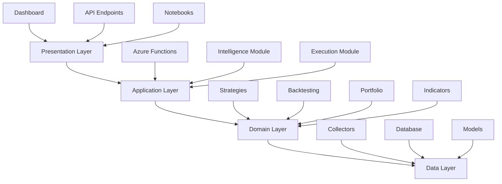
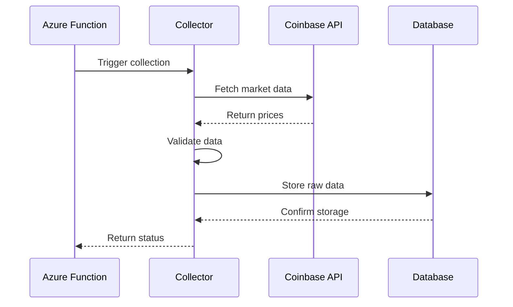
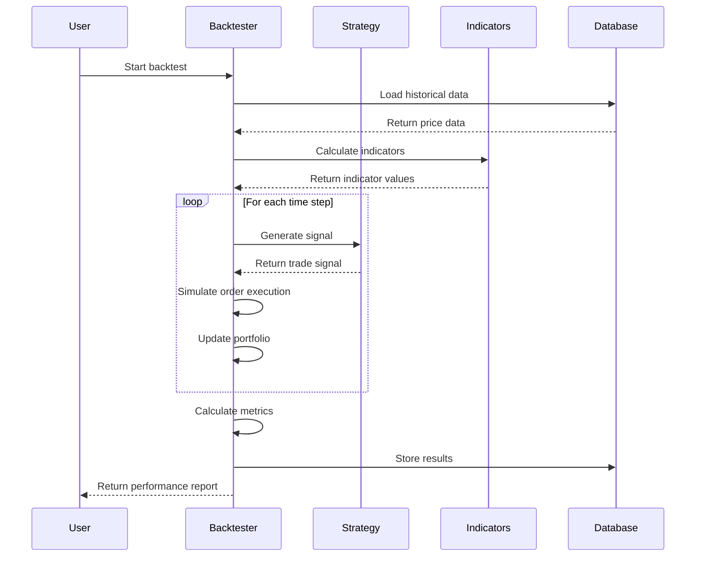
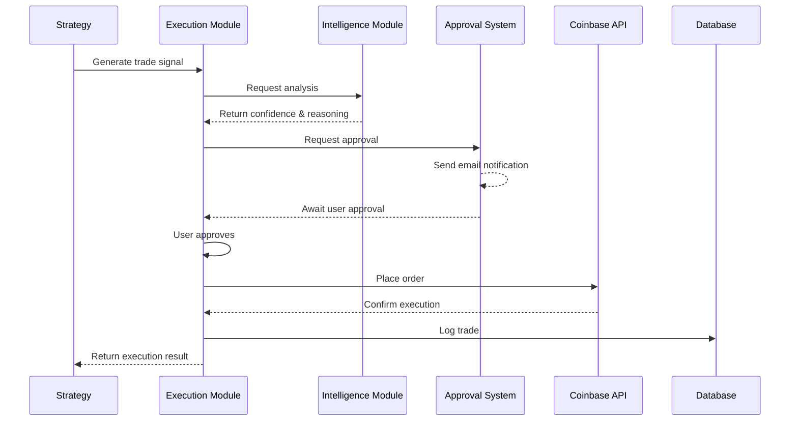

# CryptoQuant Architecture

## Overview

CryptoQuant follows a **layered architecture** pattern, emphasizing separation of concerns, maintainability, and extensibility. The architecture is designed specifically for cryptocurrency quantitative research while maintaining clean boundaries between layers.

## Architecture Principles

1. **Separation of Concerns**: Each layer has a specific responsibility
2. **Dependency Rule**: Dependencies flow downward only (presentation → application → domain → data)
3. **Type Safety**: Comprehensive type hints throughout the codebase
4. **Testability**: Each layer can be tested in isolation
5. **Scalability**: Design supports growth in data volume and feature complexity

## Layered Architecture



### Layer 1: Data Layer

**Purpose**: Handles all data persistence and external data sources.

**Components**:
- `collectors/` - Market data collection from Coinbase API
- `database/` - SQLAlchemy models, session management, and database operations
- `models/` - Data models and schemas

**Responsibilities**:
- Fetch data from external APIs (Coinbase)
- Store and retrieve data from Azure SQL
- Manage database connections and transactions
- Define ORM models for all entities

**Key Patterns**:
- Repository pattern for data access
- Unit of Work pattern for transaction management
- Retry logic with exponential backoff for API calls
- Connection pooling for database efficiency

**Dependencies**: None (this is the lowest layer)

### Layer 2: Domain Layer

**Purpose**: Contains business logic and domain models.

**Components**:
- `indicators/` - Technical indicator calculations
- `strategies/` - Trading strategy implementations
- `backtesting/` - Backtesting engine and simulation
- `portfolio/` - Portfolio management and position tracking

**Responsibilities**:
- Calculate technical indicators (RSI, MACD, EMA, etc.)
- Implement trading strategies
- Run backtests with realistic order simulation
- Track portfolio holdings and performance
- Calculate risk metrics

**Key Patterns**:
- Strategy pattern for trading strategies
- Template method for backtesting framework
- Observer pattern for event-driven backtesting
- Value objects for immutable financial data

**Dependencies**: Data Layer only

### Layer 3: Application Layer

**Purpose**: Orchestrates use cases and coordinates domain operations.

**Components**:
- `functions/` - Azure Functions for scheduled tasks
- `intelligence/` - OpenAI integration for AI analysis
- `execution/` - Trade execution with approval workflows

**Responsibilities**:
- Coordinate complex workflows
- Schedule periodic data collection
- Generate AI-powered insights
- Manage approval workflows
- Execute trades through Coinbase
- Log all operations

**Key Patterns**:
- Command pattern for trade execution
- Facade pattern for complex workflows
- Chain of Responsibility for approval workflows
- Template pattern for scheduled functions

**Dependencies**: Domain Layer and Data Layer

### Layer 4: Presentation Layer

**Purpose**: User interfaces and external APIs.

**Components**:
- `api/` - FastAPI REST endpoints (future)
- `dashboard/` - Web-based visualization dashboard (future)
- `notebooks/` - Jupyter notebooks for research

**Responsibilities**:
- Expose REST APIs for external access
- Provide interactive dashboards
- Enable ad-hoc research and exploration
- Visualize data and results

**Key Patterns**:
- MVC pattern for web interfaces
- DTO pattern for API responses
- Presenter pattern for data formatting

**Dependencies**: Application Layer, Domain Layer, and Data Layer

## Cross-Cutting Concerns

These modules support all layers:

### Configuration (`config/`)

- Environment-specific settings
- API credentials management
- Feature flags
- Logging configuration
- Database connection strings

**Pattern**: Singleton pattern with environment-based overrides using Pydantic Settings

### Common Utilities (`common/`)

- Date/time helpers
- Retry logic decorators
- Logging utilities
- Validation helpers
- Error handlers

**Pattern**: Utility/helper functions with no state

## Data Flow

### Market Data Collection Flow



### Strategy Backtesting Flow



### Trade Execution Flow (with Approval)



## Dependency Rules

### The Dependency Rule

Source code dependencies must point **inward only**. Inner layers know nothing about outer layers.

**Valid Dependencies**:
- Presentation → Application → Domain → Data ✅
- Application → Domain ✅
- Domain → Data ✅

**Invalid Dependencies**:
- Data → Domain ❌
- Domain → Application ❌
- Any layer → Presentation ❌

### Dependency Inversion

When an inner layer needs to communicate outward (e.g., Domain layer needs to notify Application layer), we use:

1. **Interfaces/Protocols**: Domain defines an interface, Application implements it
2. **Events**: Domain publishes events, Application subscribes
3. **Callbacks**: Application passes callbacks to Domain

Example:
```python
# Domain layer defines interface
class OrderExecutor(Protocol):
    def execute_order(self, order: Order) -> ExecutionResult:
        ...

# Application layer implements
class CoinbaseExecutor:
    def execute_order(self, order: Order) -> ExecutionResult:
        # Implementation using Coinbase API
        ...

# Domain layer uses the interface
class Strategy:
    def __init__(self, executor: OrderExecutor):
        self.executor = executor
```

## Cryptocurrency-Specific Design

### Market Data Model

The platform is optimized for cryptocurrency markets:

- **24/7 Trading**: No market hours, continuous data collection
- **High Volatility**: Risk metrics adjusted for crypto volatility
- **Fractional Trading**: Support for sub-unit trading (0.001 BTC)
- **Fee Structure**: Maker/taker fees specific to Coinbase

### Coinbase API Integration

**Rate Limiting**:
- Implement exponential backoff
- Request queuing to stay within limits
- Cached responses for recent data

**Authentication**:
- API key + secret stored securely in Azure Key Vault
- Automatic signature generation
- Token refresh handling

**WebSocket Support**:
- Real-time price updates
- Order book streaming
- Trade feed subscriptions

### Time Series Optimization

Cryptocurrency data is inherently time-series:

- **Storage**: Columnar format (Parquet) for efficient querying
- **Indexing**: Time-based partitioning in database
- **Caching**: Recent data cached in memory
- **Aggregation**: Pre-computed OHLCV at multiple resolutions

## Design Patterns Summary

| Pattern | Layer | Purpose |
|---------|-------|---------|
| Repository | Data | Abstraction over data access |
| Unit of Work | Data | Transaction management |
| Strategy | Domain | Pluggable trading algorithms |
| Template Method | Domain | Backtesting framework |
| Observer | Domain | Event-driven simulation |
| Command | Application | Trade execution |
| Facade | Application | Complex workflow orchestration |
| Singleton | Config | Single configuration instance |
| Factory | All | Object creation |
| Decorator | Common | Retry logic, logging |

## Error Handling Strategy

### Error Categories

1. **Transient Errors** (retry automatically)
   - API timeouts
   - Network issues
   - Rate limit exceeded

2. **Invalid Data Errors** (log and skip)
   - Malformed API responses
   - Missing required fields
   - Validation failures

3. **Business Logic Errors** (fail fast)
   - Insufficient funds
   - Position limits exceeded
   - Invalid order parameters

4. **Critical Errors** (alert and stop)
   - Database connection lost
   - API authentication failed
   - Data corruption detected

### Error Handling Implementation

```python
from cryptoquant.common.retry import with_retry
from cryptoquant.common.logging import logger

@with_retry(max_attempts=3, backoff_factor=2)
async def fetch_market_data(symbol: str) -> MarketData:
    """Fetch market data with automatic retry on transient errors."""
    try:
        response = await coinbase_client.get_price(symbol)
        return validate_and_parse(response)
    except ValidationError as e:
        logger.warning(f"Invalid data for {symbol}: {e}")
        raise
    except APIError as e:
        if e.is_transient:
            raise  # Will be retried
        logger.error(f"API error for {symbol}: {e}")
        raise
```

## Testing Strategy

### Unit Tests
- Test each module in isolation
- Mock external dependencies
- Focus on business logic
- Fast execution (< 1 second total)

### Integration Tests
- Test layer interactions
- Use test database
- Mock external APIs (Coinbase, OpenAI)
- Moderate execution time (< 30 seconds)

### End-to-End Tests
- Test complete workflows
- Use test environment with real services
- Limited scope (happy paths only)
- Longer execution time (minutes)

## Performance Considerations

### Database Optimization
- Connection pooling (10-20 connections)
- Query optimization with proper indexes
- Batch inserts for bulk data
- Read replicas for analytics

### Caching Strategy
- In-memory cache for recent prices (Redis future)
- Pre-computed indicator values
- Cached API responses (5-minute TTL)

### Asynchronous Processing
- Use `asyncio` for I/O-bound operations
- Parallel indicator calculations
- Background job processing with Azure Functions

## Security Considerations

### API Key Management
- Store credentials in Azure Key Vault
- Never commit secrets to git
- Rotate keys regularly
- Use environment-specific keys

### Database Security
- Encrypted connections (SSL/TLS)
- Principle of least privilege for database users
- Audit logging for sensitive operations
- Regular backups with encryption

### Input Validation
- Validate all external inputs with Pydantic
- Sanitize database queries (use ORM)
- Rate limiting on public endpoints
- Authentication on all API endpoints

## Monitoring and Observability

### Logging
- Structured logging (JSON format)
- Log levels: DEBUG, INFO, WARNING, ERROR, CRITICAL
- Separate logs by component
- Centralized log aggregation (Azure Monitor)

### Metrics
- Data collection latency
- API response times
- Backtest execution duration
- Order execution success rate

### Alerting
- Failed data collection runs
- API authentication failures
- Unusual trading activity
- Database connection issues

## Scalability Considerations

### Current Design Supports
- Up to 1000 symbols tracked
- Hourly data collection
- Multi-year backtests
- Concurrent strategy evaluation

### Future Scaling Options
- Horizontal scaling with containerization
- Message queue for decoupled processing (Azure Service Bus)
- Time-series database for tick data (InfluxDB)
- Distributed backtesting (Dask, Ray)

## Conclusion

This architecture provides a solid foundation for cryptocurrency quantitative research while maintaining flexibility for future enhancements. The layered design ensures maintainability, the dependency rules enforce clean boundaries, and the patterns enable testability and extensibility.
