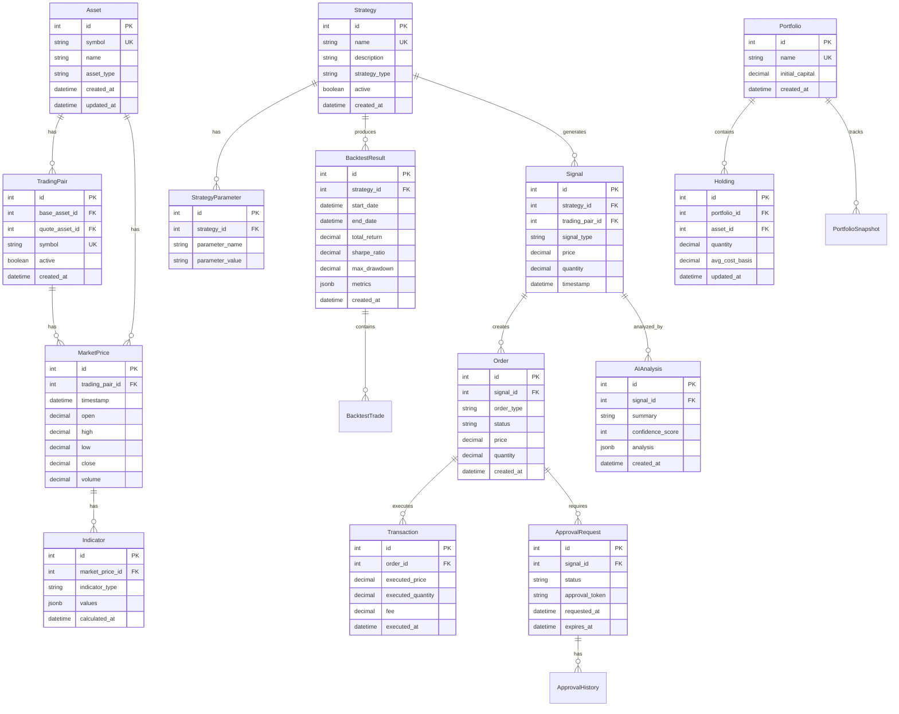

# CryptoQuant Database Design

## Overview

This document describes the database schema for CryptoQuant, an institutional-grade quantitative research platform for cryptocurrency trading. The schema is designed for Azure SQL using SQLAlchemy ORM.

## Design Principles

1. **Normalization**: 3NF for data integrity and minimal redundancy
2. **Temporal**: All entities track creation and modification timestamps
3. **Auditability**: Full audit trail for financial transactions
4. **Performance**: Indexes optimized for time-series queries
5. **Scalability**: Partitioning strategy for large time-series tables
6. **Type Safety**: Strict column types with constraints

## Entity-Relationship Diagram



## Core Tables

### Assets Table

Stores information about cryptocurrency assets.

```sql
CREATE TABLE assets (
    id INT PRIMARY KEY IDENTITY(1,1),
    symbol VARCHAR(20) UNIQUE NOT NULL,  -- e.g., 'BTC', 'ETH'
    name VARCHAR(100) NOT NULL,          -- e.g., 'Bitcoin', 'Ethereum'
    asset_type VARCHAR(20) NOT NULL,     -- 'cryptocurrency'
    decimals INT NOT NULL DEFAULT 8,
    active BIT NOT NULL DEFAULT 1,
    created_at DATETIME2 NOT NULL DEFAULT GETUTCDATE(),
    updated_at DATETIME2 NOT NULL DEFAULT GETUTCDATE(),

    INDEX IX_assets_symbol (symbol),
    INDEX IX_assets_active (active)
);
```

**Key Fields**:
- `symbol`: Asset ticker (BTC, ETH, etc.)
- `decimals`: Precision for fractional amounts
- `active`: Whether asset is currently tradeable

### TradingPair Table

Represents tradeable pairs (e.g., BTC-USD).

```sql
CREATE TABLE trading_pairs (
    id INT PRIMARY KEY IDENTITY(1,1),
    base_asset_id INT NOT NULL,          -- e.g., BTC
    quote_asset_id INT NOT NULL,         -- e.g., USD
    symbol VARCHAR(20) UNIQUE NOT NULL,  -- 'BTC-USD'
    active BIT NOT NULL DEFAULT 1,
    min_order_size DECIMAL(18, 8),
    max_order_size DECIMAL(18, 8),
    created_at DATETIME2 NOT NULL DEFAULT GETUTCDATE(),
    updated_at DATETIME2 NOT NULL DEFAULT GETUTCDATE(),

    FOREIGN KEY (base_asset_id) REFERENCES assets(id),
    FOREIGN KEY (quote_asset_id) REFERENCES assets(id),
    INDEX IX_trading_pairs_symbol (symbol),
    INDEX IX_trading_pairs_active (active)
);
```

### MarketPrice Table

Time-series data for market prices (OHLCV).

```sql
CREATE TABLE market_prices (
    id BIGINT PRIMARY KEY IDENTITY(1,1),
    trading_pair_id INT NOT NULL,
    timestamp DATETIME2 NOT NULL,
    open DECIMAL(18, 8) NOT NULL,
    high DECIMAL(18, 8) NOT NULL,
    low DECIMAL(18, 8) NOT NULL,
    close DECIMAL(18, 8) NOT NULL,
    volume DECIMAL(18, 8) NOT NULL,
    data_source VARCHAR(50) NOT NULL DEFAULT 'coinbase',
    created_at DATETIME2 NOT NULL DEFAULT GETUTCDATE(),

    FOREIGN KEY (trading_pair_id) REFERENCES trading_pairs(id),
    UNIQUE INDEX UX_market_prices_pair_timestamp (trading_pair_id, timestamp),
    INDEX IX_market_prices_timestamp (timestamp DESC)
);
```

**Partitioning Strategy**: Partition by `timestamp` (monthly partitions) for efficient querying.

**Indexes**:
- Composite unique index on `(trading_pair_id, timestamp)` prevents duplicates
- Descending index on `timestamp` for recent data queries

### Indicator Table

Stores calculated technical indicators.

```sql
CREATE TABLE indicators (
    id BIGINT PRIMARY KEY IDENTITY(1,1),
    market_price_id BIGINT NOT NULL,
    indicator_type VARCHAR(50) NOT NULL,  -- 'RSI', 'MACD', 'EMA', etc.
    values NVARCHAR(MAX) NOT NULL,        -- JSON: {'rsi': 65.2, 'signal': 'overbought'}
    calculated_at DATETIME2 NOT NULL DEFAULT GETUTCDATE(),

    FOREIGN KEY (market_price_id) REFERENCES market_prices(id),
    INDEX IX_indicators_price_type (market_price_id, indicator_type)
);
```

**Note**: `values` stores indicator-specific data as JSON for flexibility.

## Strategy Tables

### Strategy Table

Defines trading strategies.

```sql
CREATE TABLE strategies (
    id INT PRIMARY KEY IDENTITY(1,1),
    name VARCHAR(100) UNIQUE NOT NULL,
    description NVARCHAR(MAX),
    strategy_type VARCHAR(50) NOT NULL,  -- 'momentum', 'mean_reversion', etc.
    version VARCHAR(20) NOT NULL DEFAULT '1.0',
    active BIT NOT NULL DEFAULT 1,
    created_at DATETIME2 NOT NULL DEFAULT GETUTCDATE(),
    updated_at DATETIME2 NOT NULL DEFAULT GETUTCDATE(),

    INDEX IX_strategies_name (name),
    INDEX IX_strategies_active (active)
);
```

### StrategyParameter Table

Configurable parameters for strategies.

```sql
CREATE TABLE strategy_parameters (
    id INT PRIMARY KEY IDENTITY(1,1),
    strategy_id INT NOT NULL,
    parameter_name VARCHAR(100) NOT NULL,
    parameter_value VARCHAR(200) NOT NULL,
    parameter_type VARCHAR(20) NOT NULL,  -- 'int', 'float', 'string', 'bool'

    FOREIGN KEY (strategy_id) REFERENCES strategies(id) ON DELETE CASCADE,
    UNIQUE INDEX UX_strategy_params (strategy_id, parameter_name)
);
```

**Example Parameters**:
- RSI period: 14
- EMA fast period: 12
- Position size: 0.1 (10% of capital)

## Backtesting Tables

### BacktestResult Table

Stores backtest execution results.

```sql
CREATE TABLE backtest_results (
    id INT PRIMARY KEY IDENTITY(1,1),
    strategy_id INT NOT NULL,
    trading_pair_id INT NOT NULL,
    start_date DATETIME2 NOT NULL,
    end_date DATETIME2 NOT NULL,
    initial_capital DECIMAL(18, 2) NOT NULL,
    final_capital DECIMAL(18, 2) NOT NULL,
    total_return DECIMAL(10, 4) NOT NULL,      -- Percentage
    sharpe_ratio DECIMAL(10, 4),
    sortino_ratio DECIMAL(10, 4),
    max_drawdown DECIMAL(10, 4),
    win_rate DECIMAL(10, 4),
    num_trades INT NOT NULL,
    avg_trade_duration_hours DECIMAL(10, 2),
    metrics NVARCHAR(MAX),                      -- JSON: Full metrics
    equity_curve NVARCHAR(MAX),                 -- JSON: Time-series equity
    created_at DATETIME2 NOT NULL DEFAULT GETUTCDATE(),

    FOREIGN KEY (strategy_id) REFERENCES strategies(id),
    FOREIGN KEY (trading_pair_id) REFERENCES trading_pairs(id),
    INDEX IX_backtest_results_strategy (strategy_id),
    INDEX IX_backtest_results_created (created_at DESC)
);
```

### BacktestTrade Table

Individual trades from backtests.

```sql
CREATE TABLE backtest_trades (
    id BIGINT PRIMARY KEY IDENTITY(1,1),
    backtest_result_id INT NOT NULL,
    entry_timestamp DATETIME2 NOT NULL,
    exit_timestamp DATETIME2,
    direction VARCHAR(10) NOT NULL,         -- 'long', 'short'
    entry_price DECIMAL(18, 8) NOT NULL,
    exit_price DECIMAL(18, 8),
    quantity DECIMAL(18, 8) NOT NULL,
    pnl DECIMAL(18, 2),
    pnl_percentage DECIMAL(10, 4),
    fees DECIMAL(18, 2),

    FOREIGN KEY (backtest_result_id) REFERENCES backtest_results(id) ON DELETE CASCADE,
    INDEX IX_backtest_trades_result (backtest_result_id)
);
```

## Execution Tables

### Signal Table

Trading signals generated by strategies.

```sql
CREATE TABLE signals (
    id BIGINT PRIMARY KEY IDENTITY(1,1),
    strategy_id INT NOT NULL,
    trading_pair_id INT NOT NULL,
    signal_type VARCHAR(20) NOT NULL,       -- 'buy', 'sell', 'hold'
    price DECIMAL(18, 8) NOT NULL,
    quantity DECIMAL(18, 8) NOT NULL,
    confidence DECIMAL(5, 2),               -- 0-100
    metadata NVARCHAR(MAX),                 -- JSON: Additional context
    timestamp DATETIME2 NOT NULL DEFAULT GETUTCDATE(),

    FOREIGN KEY (strategy_id) REFERENCES strategies(id),
    FOREIGN KEY (trading_pair_id) REFERENCES trading_pairs(id),
    INDEX IX_signals_timestamp (timestamp DESC),
    INDEX IX_signals_strategy (strategy_id)
);
```

### Order Table

Orders placed on exchanges.

```sql
CREATE TABLE orders (
    id BIGINT PRIMARY KEY IDENTITY(1,1),
    signal_id BIGINT,                       -- Link to originating signal
    trading_pair_id INT NOT NULL,
    order_type VARCHAR(20) NOT NULL,        -- 'market', 'limit'
    side VARCHAR(10) NOT NULL,              -- 'buy', 'sell'
    status VARCHAR(20) NOT NULL,            -- 'pending', 'approved', 'placed', 'filled', 'canceled', 'rejected'
    price DECIMAL(18, 8),                   -- NULL for market orders
    quantity DECIMAL(18, 8) NOT NULL,
    filled_quantity DECIMAL(18, 8) DEFAULT 0,
    average_fill_price DECIMAL(18, 8),
    exchange_order_id VARCHAR(100),
    created_at DATETIME2 NOT NULL DEFAULT GETUTCDATE(),
    updated_at DATETIME2 NOT NULL DEFAULT GETUTCDATE(),

    FOREIGN KEY (signal_id) REFERENCES signals(id),
    FOREIGN KEY (trading_pair_id) REFERENCES trading_pairs(id),
    INDEX IX_orders_status (status),
    INDEX IX_orders_created (created_at DESC)
);
```

### Transaction Table

Executed trade transactions.

```sql
CREATE TABLE transactions (
    id BIGINT PRIMARY KEY IDENTITY(1,1),
    order_id BIGINT NOT NULL,
    executed_price DECIMAL(18, 8) NOT NULL,
    executed_quantity DECIMAL(18, 8) NOT NULL,
    fee DECIMAL(18, 8) NOT NULL,
    fee_currency VARCHAR(10) NOT NULL,
    exchange_transaction_id VARCHAR(100),
    executed_at DATETIME2 NOT NULL,
    created_at DATETIME2 NOT NULL DEFAULT GETUTCDATE(),

    FOREIGN KEY (order_id) REFERENCES orders(id),
    INDEX IX_transactions_order (order_id),
    INDEX IX_transactions_executed (executed_at DESC)
);
```

## Approval Tables

### ApprovalRequest Table

Approval workflow for trades.

```sql
CREATE TABLE approval_requests (
    id BIGINT PRIMARY KEY IDENTITY(1,1),
    signal_id BIGINT NOT NULL,
    status VARCHAR(20) NOT NULL,            -- 'pending', 'approved', 'rejected', 'expired'
    approval_token VARCHAR(100) UNIQUE NOT NULL,
    requested_at DATETIME2 NOT NULL DEFAULT GETUTCDATE(),
    expires_at DATETIME2 NOT NULL,
    decided_at DATETIME2,

    FOREIGN KEY (signal_id) REFERENCES signals(id),
    INDEX IX_approval_requests_status (status),
    INDEX IX_approval_requests_token (approval_token)
);
```

### ApprovalHistory Table

Audit trail for approval decisions.

```sql
CREATE TABLE approval_history (
    id BIGINT PRIMARY KEY IDENTITY(1,1),
    approval_request_id BIGINT NOT NULL,
    decision VARCHAR(20) NOT NULL,          -- 'approved', 'rejected'
    decided_by VARCHAR(100) NOT NULL,       -- Email or user ID
    rationale NVARCHAR(500),
    decided_at DATETIME2 NOT NULL DEFAULT GETUTCDATE(),

    FOREIGN KEY (approval_request_id) REFERENCES approval_requests(id),
    INDEX IX_approval_history_request (approval_request_id)
);
```

## Portfolio Tables

### Portfolio Table

Portfolio definitions.

```sql
CREATE TABLE portfolios (
    id INT PRIMARY KEY IDENTITY(1,1),
    name VARCHAR(100) UNIQUE NOT NULL,
    description NVARCHAR(500),
    initial_capital DECIMAL(18, 2) NOT NULL,
    currency VARCHAR(10) NOT NULL DEFAULT 'USD',
    created_at DATETIME2 NOT NULL DEFAULT GETUTCDATE(),
    updated_at DATETIME2 NOT NULL DEFAULT GETUTCDATE(),

    INDEX IX_portfolios_name (name)
);
```

### Holding Table

Current portfolio holdings.

```sql
CREATE TABLE holdings (
    id INT PRIMARY KEY IDENTITY(1,1),
    portfolio_id INT NOT NULL,
    asset_id INT NOT NULL,
    quantity DECIMAL(18, 8) NOT NULL,
    avg_cost_basis DECIMAL(18, 8) NOT NULL,
    total_cost DECIMAL(18, 2) NOT NULL,
    updated_at DATETIME2 NOT NULL DEFAULT GETUTCDATE(),

    FOREIGN KEY (portfolio_id) REFERENCES portfolios(id),
    FOREIGN KEY (asset_id) REFERENCES assets(id),
    UNIQUE INDEX UX_holdings_portfolio_asset (portfolio_id, asset_id)
);
```

### PortfolioSnapshot Table

Historical portfolio values.

```sql
CREATE TABLE portfolio_snapshots (
    id BIGINT PRIMARY KEY IDENTITY(1,1),
    portfolio_id INT NOT NULL,
    timestamp DATETIME2 NOT NULL,
    total_value DECIMAL(18, 2) NOT NULL,
    cash_balance DECIMAL(18, 2) NOT NULL,
    invested_capital DECIMAL(18, 2) NOT NULL,
    unrealized_pnl DECIMAL(18, 2) NOT NULL,
    realized_pnl DECIMAL(18, 2) NOT NULL,
    num_holdings INT NOT NULL,
    created_at DATETIME2 NOT NULL DEFAULT GETUTCDATE(),

    FOREIGN KEY (portfolio_id) REFERENCES portfolios(id),
    INDEX IX_portfolio_snapshots_portfolio_time (portfolio_id, timestamp DESC)
);
```

## AI Analysis Tables

### AIAnalysis Table

AI-generated market analysis and insights.

```sql
CREATE TABLE ai_analyses (
    id BIGINT PRIMARY KEY IDENTITY(1,1),
    signal_id BIGINT,                       -- Optional: Linked signal
    analysis_type VARCHAR(50) NOT NULL,     -- 'market_summary', 'trade_analysis', etc.
    prompt NVARCHAR(MAX) NOT NULL,
    response NVARCHAR(MAX) NOT NULL,
    confidence_score INT,                   -- 0-100
    model VARCHAR(50) NOT NULL,             -- e.g., 'gpt-4'
    tokens_used INT,
    created_at DATETIME2 NOT NULL DEFAULT GETUTCDATE(),

    FOREIGN KEY (signal_id) REFERENCES signals(id),
    INDEX IX_ai_analyses_type (analysis_type),
    INDEX IX_ai_analyses_created (created_at DESC)
);
```

## Indexing Strategy

### Time-Series Optimizations
- **Clustered Indexes**: Use `timestamp DESC` for time-series tables
- **Partitioning**: Partition large tables (`market_prices`, `transactions`) by month
- **Covering Indexes**: Include frequently accessed columns in indexes

### Query-Specific Indexes
```sql
-- Frequent query: Get recent prices for a trading pair
CREATE INDEX IX_market_prices_pair_time 
ON market_prices (trading_pair_id, timestamp DESC) 
INCLUDE (close, volume);

-- Frequent query: Get pending approvals
CREATE INDEX IX_approval_requests_pending 
ON approval_requests (status, expires_at) 
WHERE status = 'pending';

-- Frequent query: Portfolio holdings with current prices
CREATE INDEX IX_holdings_portfolio_asset 
ON holdings (portfolio_id, asset_id) 
INCLUDE (quantity, avg_cost_basis);
```

## Data Retention Policy

### Hot Data (Active Queries)
- **Market Prices**: Last 2 years
- **Signals & Orders**: Last 1 year
- **Transactions**: All (never delete)
- **Portfolio Snapshots**: Last 3 years

### Cold Data (Archive)
- Move older data to Azure Blob Storage
- Maintain indexed metadata for queries
- Load on-demand for historical analysis

## Backup Strategy

- **Full Backup**: Daily at 02:00 UTC
- **Differential Backup**: Every 6 hours
- **Transaction Log Backup**: Every 15 minutes
- **Retention**: 30 days online, 1 year archive
- **Geo-Redundant**: Replicate to secondary region

## Migration Strategy

### Using Alembic

```bash
# Generate migration from model changes
alembic revision --autogenerate -m "Add ai_analyses table"

# Apply migration
alembic upgrade head

# Rollback if needed
alembic downgrade -1
```

### Best Practices
- Never modify existing migrations
- Test migrations on dev database first
- Include rollback logic for all changes
- Document breaking changes

## Future Enhancements

### Planned Additions
- `Strategy_Execution_Log` - Detailed strategy execution metrics
- `Alert_Rules` - User-defined alerts
- `Webhook_Events` - External system integrations
- `Audit_Log` - Comprehensive system audit trail

### Scalability Considerations
- **Read Replicas**: For analytics and reporting
- **Sharding**: By trading pair if single database becomes bottleneck
- **Time-Series DB**: Consider InfluxDB for tick data in future
- **Caching Layer**: Redis for frequently accessed data

---

**This schema provides a solid foundation for CryptoQuant's quantitative research platform, balancing normalization with query performance while maintaining full auditability.**
